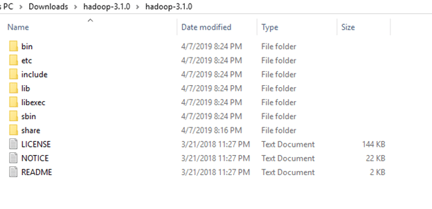

# HadoopForWindows


## Installation

### Download

| Software | Link |
| --- | --- |
| Java DK (JDK) | https://www.oracle.com/java/technologies/downloads/#java8 |
| Hadoop | https://github.com/kevinpruvost/HadoopForWindows/tree/53c7ccbb5950cfd1f1b3f9ae7c63cb9493220017 |

<aside>
⚠️ Once you downloaded JDK and Hadoop, install these files wherever you want but keep in mind the location of these folders.

</aside>



### Environment Setup

Once Hadoop and JDK folders are on your PC, then we'll need to setup some environment variables.

- Go on *'Edit the system environment variables'*:


- Set JAVA_HOME and HADOOP_HOME to the locations of your folders:


- Then add the Hadoop and JDK bin folders to the *'Path'* variable:


### Hadoop Configuration

1. Create these folders:
    - /hadoop/data
    - /hadoop/data/datanode
    - /hadoop/data/namenode
2. Once Hadoop and JDK are installed, you will have to configure Hadoop to make it work with your environment, to do so, you'll have to change some .xml and .cmd files:
- **hadoop/etc/hadoop/core-site.xml**

```xml
<?xml version="1.0" encoding="UTF-8"?>
<?xml-stylesheet type="text/xsl" href="configuration.xsl"?>

<configuration>
   <property>
       <name>fs.defaultFS</name>
       <value>hdfs://localhost:9000</value>
   </property>
</configuration>
```

- **hadoop/etc/hadoop/mapred-site.xml**

```xml
<?xml version="1.0"?>
<?xml-stylesheet type="text/xsl" href="configuration.xsl"?>

<configuration>
   <property>
       <name>mapreduce.framework.name</name>
       <value>yarn</value>
   </property>
</configuration>
```

- **hadoop/etc/hadoop/hdfs-site.xml**
*Set the path of your namenode and datanade folders.*

```xml
<?xml version="1.0" encoding="UTF-8"?>
<?xml-stylesheet type="text/xsl" href="configuration.xsl"?>

<configuration>
   <property>
       <name>dfs.replication</name>
       <value>1</value>
   </property>
   <property>
       <name>dfs.namenode.name.dir</name>
       <value>/hadoop-3.2.2/data/namenode</value>
   </property>
   <property>
       <name>dfs.datanode.data.dir</name>
       <value>/hadoop-3.2.2/data/datanode</value>
   </property>
</configuration>
```

- **hadoop/etc/hadoop/yarn-site.xml**

```xml
<?xml version="1.0"?>

<configuration>
   <property>
     <name>yarn.nodemanager.aux-services</name>
     <value>mapreduce_shuffle</value>
   </property>
   <property>
       <name>yarn.nodemanager.auxservices.mapreduce.shuffle.class</name>  
<value>org.apache.hadoop.mapred.ShuffleHandler</value>
   </property>
</configuration>
```

- **hadoop/etc/hadoop/hadoop-env.cmd**
*Set the path of your JDK folder.*

```powershell
set JAVA_HOME="C:\Program Files\Java\jdk1.8.0_311"
```

### Launching Hadoop

1. Start a Powershell terminal into the */hadoop/sbin* folder.

<aside>
⚠️  **Don't forget to run Powershell as an Administrator.**

</aside>

1. Launch these commands:

```powershell
hdfs namenode -format
```

```powershell
.\start-dfs.cmd
```

```powershell
.\start-yarn.cmd
```

If you want to check if all of these commands worked and are working, then launch this command:

```powershell
jps
```

## Useful Links

[HDFS Commands - GeeksforGeeks](https://www.geeksforgeeks.org/hdfs-commands/)

[How to Install and Run Hadoop on Windows for Beginners](https://www.datasciencecentral.com/profiles/blogs/how-to-install-and-run-hadoop-on-windows-for-beginners)

[Failed to start namenode in hadoop?](https://stackoverflow.com/questions/34871814/failed-to-start-namenode-in-hadoop)

[https://sparkbyexamples.com/hadoop/incompatible-clusterids/](https://sparkbyexamples.com/hadoop/incompatible-clusterids/)